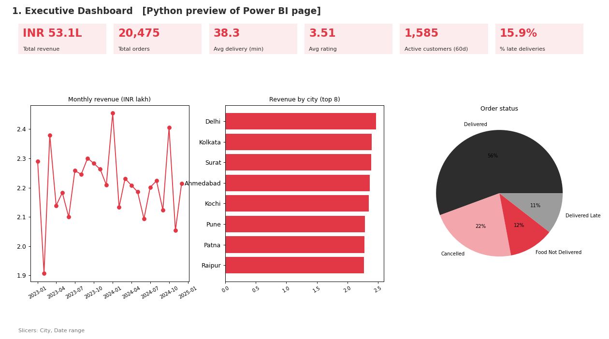
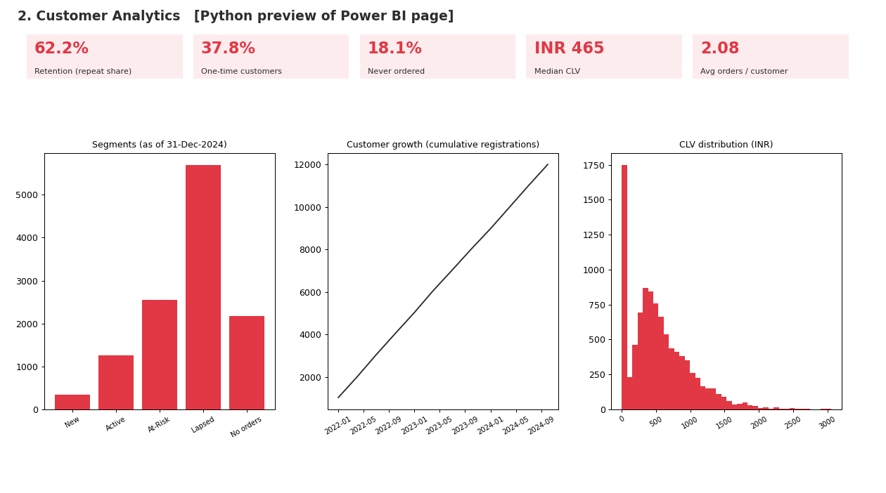
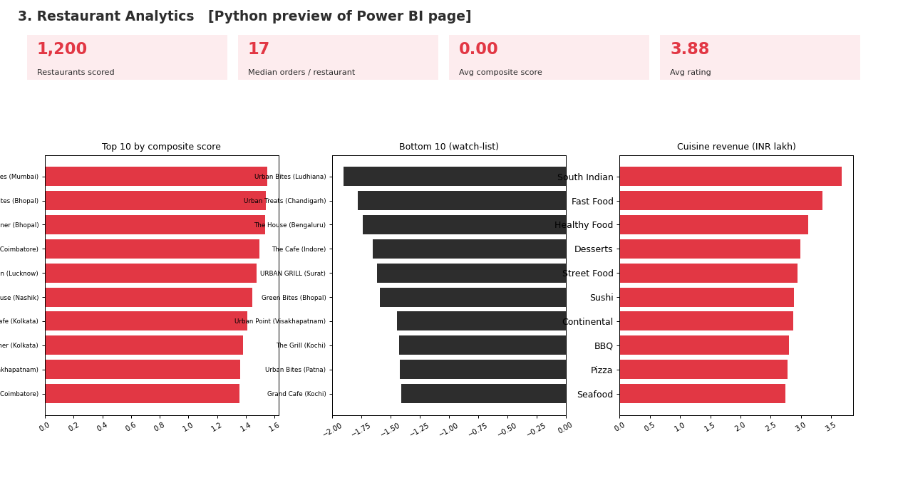
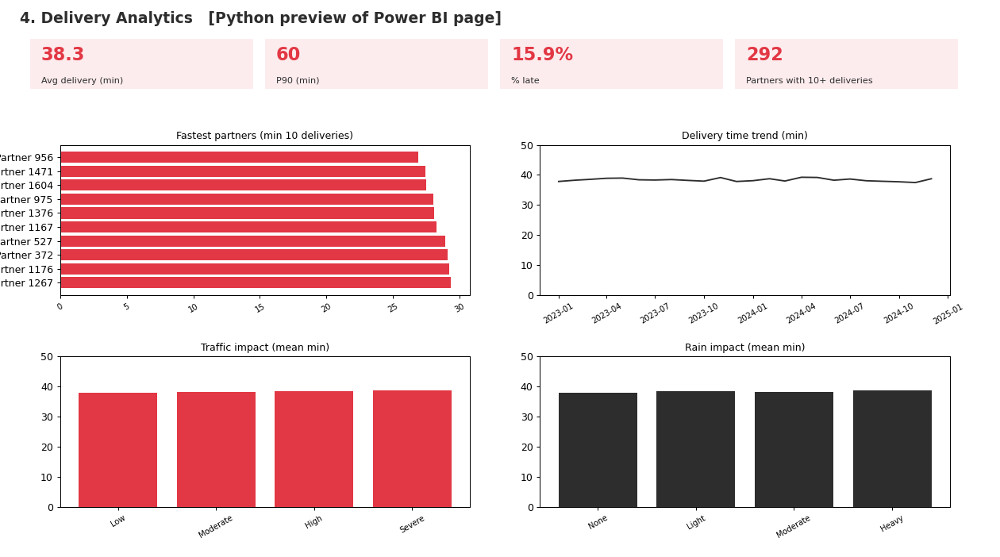
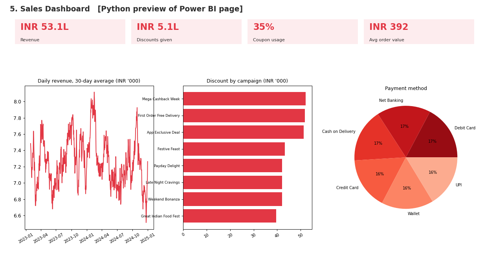
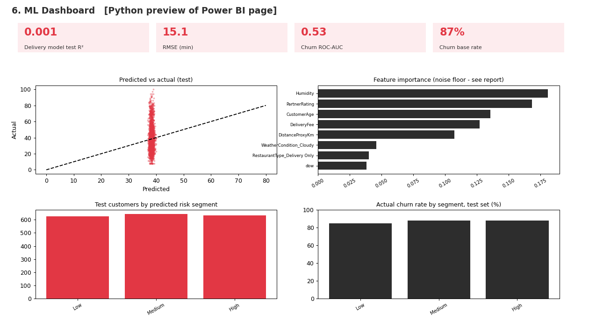

# Zomato Business Intelligence & Delivery Time Prediction Platform

End-to-end data analytics and machine-learning capstone: relational schema and SQL, a reproducible Python cleaning pipeline,
EDA, delivery-time regression, 60-day churn classification, a Power BI build kit, and stakeholder reports.

> **Headline finding (read this first).** On this dataset, *neither model beats a trivial baseline*:
> delivery-time test R² ≈ 0.00 (PRD target 0.75, RMSE 15.1 min vs target ≤ 6) and churn ROC-AUC ≈ 0.53 (0.50 = coin flip).
> The cause is in the data, not the code: 23 permutation tests found only 2 effects at p < 0.05 (≈ 1.2 expected by chance).
> Order timing is structured (lunch/dinner peaks); the real operational problem is **33.9% of orders failing**
> (22.3% cancelled + 11.5% not delivered) and **15.9% of completed orders being late**. See `reports/business_insights_report.pdf`.

## Architecture & workflow

```
data/raw (12 CSV)
   │  src/ingest.py  (all columns read as text so bad values survive)
   ▼
src/clean.py  ──►  data/cleaned/*.csv + cleaning_log.csv + validation_report.csv   (31/31 integrity checks)
   │
   ├─► sql/schema.sql + load_data.sql + business_queries.sql   (PostgreSQL 14+; MySQL notes inline)
   ▼
src/features.py  (order-level ABT, customer-level churn table with a temporal split)
   ├─► src/eda.py            38 charts, KPIs, restaurant scorecard
   ├─► src/stat_checks.py    23 permutation tests (what is signal, what is noise)
   ├─► src/model_delivery.py 4 regressors + tuning + leakage demo
   ├─► src/model_churn.py    4 classifiers + imbalance handling
   ├─► src/export_powerbi.py star-schema CSVs for Power BI
   └─► src/make_reports.py   eda_report.pdf, business_insights_report.pdf
```

## Dataset
12 interconnected operational tables (customers, restaurants, menu, delivery partners, promotions, orders, order items, payments,
feedback, cities, weather, traffic), Jan 2023 - Dec 2024. 20,475 orders after cleaning (205 duplicates and 25 orphan-key orders removed).
Raw data-quality issues handled (all logged in `data/cleaned/cleaning_log.csv`): duplicates, whitespace/city aliases (Bangalore→Bengaluru…),
mixed date formats, sign-flipped negatives (verified: |FoodCost| reproduces FinalAmount for all 181 cases), invalid phones/pincodes,
out-of-range ratings, outliers, orphan foreign keys, missing values (imputation rule per column).

**Known data limits.** ~15% of slash dates are ambiguous (DD/MM vs MM/DD; resolved via payment date for orders, DD/MM otherwise);
weather/traffic dates repeat so only ~63% of orders link to them; customers have no coordinates so true restaurant-to-customer distance
does not exist (`DistanceProxyKm` is a proxy only).

## Installation
```bash
python -m venv .venv && source .venv/bin/activate      # Windows: .venv\Scripts\activate
pip install -r requirements.txt
```

## Usage
```bash
python run_pipeline.py                 # everything, raw CSV -> reports (several minutes)
python -m src.clean                    # cleaning only
python -m src.model_delivery           # one stage at a time (any src.* module)
jupyter lab notebooks/                 # run 01 -> 05 in order; all logic is inside the cells (src/ is the same code as scripts)
```
**scikit-learn note.** The environment in which this project was first executed had no internet, so `src/ml_compat.py` falls back to a
NumPy implementation (`src/mini_sklearn.py`) when scikit-learn is missing. Reported numbers come from that fallback; with scikit-learn installed
`python run_pipeline.py` regenerates all metrics, plots and `models/*.pkl` using the real library (expect small numeric differences, same conclusions).
The shipped `.pkl` files contain fallback-class objects and load only with this repo's `src/` on the path.

## SQL highlights (`sql/`)
26 analytical queries + 2 views + 5 indexes (rationale in comments) + optional stored procedure and trigger, covering joins (inner/left/right/self/union),
CASE, scalar/correlated subqueries, CTEs, ROW_NUMBER/RANK/DENSE_RANK/LAG/LEAD/NTILE, date functions. Load with `psql -f sql/schema.sql` then
`psql -f sql/load_data.sql`. Executed end to end on PostgreSQL 18 (schema, load of 20,475 orders, all queries); output saved in `sql/query_results.txt`.

## EDA highlights (`reports/eda_report.pdf`, `images/eda_*`)
38 charts (20 Matplotlib + 18 Seaborn). Revenue INR 53.1 lakh from 13,544 completed orders, flat month to month; peaks at 12-13h and 19-20h;
weekends not busier; city, cuisine, weather, traffic, payment method and membership differences are within random variation.

## Machine-learning summary
| Task | Best by CV | Test result | PRD target |
|---|---|---|---|
| Delivery time (regression) | Random Forest (tuned) | R² 0.001, RMSE 15.13 min, MAE 11.50 (baseline-mean RMSE 15.14) | R² ≥ 0.75, RMSE ≤ 6 |
| 60-day churn (classification) | Gradient Boosting (tuned) | ROC-AUC 0.53, F1 0.71 (all-churn baseline F1 0.93) | F1 ≥ 0.70 |

Selection is by cross-validation, never by test set. `OrderStatus`/feedback are excluded from delivery-time features (post-delivery leakage);
a leakage demo (R² 0.54) is reported separately and marked unusable. Churn features use only orders up to a cutoff (2024-11-01);
the label is "no order in the next 60 days"; class imbalance (87% churn) handled with `class_weight='balanced'`.

## Power BI dashboard
`powerbi/zomato_dashboard.pbip` is a ready-to-open **Power BI Project**: 17-table star-schema model, 38 DAX measures, 6 pages / 72 visuals,
Zomato theme. The finished dashboard is saved as `powerbi/zomato_dashboard.pbix`. The project can also be opened in Power BI Desktop (click Refresh;
set the `DataPath` parameter to your `powerbi/data` folder) - see `powerbi/README_BUILD.md`.

| Page | Preview |
|---|---|
| 1 Executive |  |
| 2 Customer |  |
| 3 Restaurant |  |
| 4 Delivery |  |
| 5 Sales |  |
| 6 ML |  |

(Python-rendered previews of the specified pages, not Power BI screenshots.)

## Screenshots
ML: `images/ml_delivery_*.png`, `images/ml_churn_evaluation.png`; EDA: `images/eda_mpl_*.png`, `images/eda_sns_*.png`.

## Future improvements
* Capture failure reasons, stage timestamps, partner GPS and customer coordinates; re-run the models on that data.
* Randomised coupon holdout test; payment-vs-order-status reconciliation with Finance.
* XGBoost stretch model and time-based validation once genuine signal exists; REST deployment (out of scope here).

## Repository layout
`data/` raw + cleaned · `sql/` · `notebooks/` (executed) · `src/` · `models/` · `reports/` (EDA + insights PDFs, 12-slide deck) ·
`powerbi/` · `images/` · `documentation/prd.docx`

## License
MIT - see `LICENSE`.
